# **Adaptive Traffic Control Simulation: A JSQ-SKLQ Queuing Model**


### Abstract

This project presents a high-fidelity, discrete-event simulation of a novel adaptive traffic signal policy based on the **"Join the Shortest Queue - Serve the K-Longest Queue" (JSQ-SKLQ)** principle. Designed to optimize traffic flow at a single, two-lane intersection, this model is a robust implementation and validation of the theoretical work by Perel, Perel, and Yechiali. The simulation engine rigorously analyzes the system's performance under both preemptive and non-preemptive policies, explores the critical impact of the `K` (switching) threshold, and quantifies the trade-off between system efficiency and fairness. The results validate the analytical model, identify optimal operating parameters, and provide a powerful tool for traffic engineering research and decision support.

## **Table of Contents**

1.  [**Abstract**](#abstract)
2.  [**The Problem: Optimizing Urban Traffic Flow**](#the-problem-optimizing-urban-traffic-flow)
3.  [**The JSQ-SKLQ Model Explained**](#the-jsq-sklq-model-explained)
4.  [**Key Features of the Simulation**](#-key-features-of-the-simulation)
5.  [**System Architecture & Tech Stack**](#️-system-architecture--tech-stack)
    *   [Discrete-Event Simulation Engine](#discrete-event-simulation-engine)
    *   [Core Technology Stack](#core-technology-stack)
6.  [**Analysis & Key Findings**](#-analysis--key-findings)
    *   [1. Model Validation Against Theoretical Benchmarks](#1-model-validation-against-theoretical-benchmarks)
    *   [2. The Impact of the K-Threshold on System Performance](#2-the-impact-of-the-k-threshold-on-system-performance)
    *   [3. Preemptive vs. Non-Preemptive Policies: A Rigorous Comparison](#3-preemptive-vs-non-preemptive-policies-a-rigorous-comparison)
    *   [4. The Efficiency vs. Fairness Trade-off: A Pareto Frontier Analysis](#4-the-efficiency-vs-fairness-trade-off-a-pareto-frontier-analysis)
7.  [**Getting Started: Local Setup & Usage**](#-getting-started-local-setup--usage)
8.  [**Future Work & Roadmap**](#️-future-work--roadmap)
9.  [**Contributing**](#-contributing)
10. [**License**](#-license)
11. [**Acknowledgements**](#acknowledgements)

### The Problem: Optimizing Urban Traffic Flow

Signalized intersections are primary bottlenecks in urban road networks. Traditional traffic light systems often use fixed-time cycles, which are inefficient under fluctuating traffic demands, leading to unnecessary congestion, increased emissions, and driver frustration.

Modern adaptive strategies are needed, but they must balance two conflicting objectives:
1.  **Efficiency:** Minimize the total number of vehicles waiting in the system.
2.  **Fairness:** Ensure that no single lane is starved of service for too long.

Designing a policy that achieves this balance is a complex queuing theory problem, especially when considering the "lost time" (switch-over cost) associated with changing a traffic signal from red to green.

### The JSQ-SKLQ Model Explained

Our simulation implements a sophisticated polling model that combines two powerful queuing principles to create a self-balancing system:

1.  **Join the Shortest Queue (JSQ):** This is a *customer-centric* policy. Arriving vehicles (customers) are directed to the shorter of the two queues, naturally distributing the load.
2.  **Serve the K-Longest Queue (SKLQ):** This is a *server-centric* policy. The traffic signal (the server) makes intelligent decisions about which queue to serve next. The decision is governed by a **K-threshold**:
    *   The server will finish its current service (non-preemptive).
    *   Upon completion, it checks if the *other* queue is longer than its current queue by a margin of `K` or more.
    *   If `L_other - L_current >= K`, a switch is **mandatory** to service the critically long queue.
    *   Otherwise, the server follows the general "serve the longest queue" principle, deciding whether to stay or switch based on which queue is currently longer.

The `K` parameter is the key tuning knob: a small `K` makes the system highly responsive but risks "thrashing" (too much time lost to switching), while a large `K` is more stable but can be slow to react to imbalances. Finding the optimal `K` is the central goal of this analysis.

```mermaid
graph TD
    A["Arrival λ"] -->|Car approaches| B{"JSQ Logic"};
    B -->|L₁ < L₂| C["Queue 1"];
    B -->|L₂ <= L₁| D["Queue 2"];

    subgraph "Intersection (Server)"
        E["Green Light"]
    end

    C -->|Waiting| E;
    D -->|Waiting| E;

    E -->|"SKLQ Logic\n(Checks L₁, L₂, K)"| F{"Decision"};
    F -->|Serve Q₁| C;
    F -->|Serve Q₂| D;

```



### Key Features of the Simulation

This is not just a script, but a robust simulation framework built for rigorous analysis and experimentation.

| Feature                          | Description                                                                                                                                                                                                                                                          |
| -------------------------------- | -------------------------------------------------------------------------------------------------------------------------------------------------------------------------------------------------------------------------------------------------------------------- |
| **Highly Configurable Engine**  | All key system parameters (`λ`, `μ₁`, `μ₂`, `p₁`, `K`, switch-over times) are fully configurable, allowing for extensive sensitivity analysis and scenario testing.                                                                                                |
| **Preemptive vs. Non-Preemptive Modes** | The engine can run in two distinct modes to compare the performance of preemptive (interrupt-driven) vs. non-preemptive (completion-driven) service policies.                                                                                             |
| **Comprehensive Metric Suite** | Calculates a wide range of performance indicators, including mean queue lengths (`Lq`), mean sojourn time (`W`), system utilization, Gini index for fairness, and server switch rates.                                                                            |
| **Statistical Replication Engine** | Includes helper functions to run multiple replications with different random seeds and automatically calculate means and 95% confidence intervals, ensuring statistically sound conclusions.                                                                |
| **Interactive Visualizations**  | Leverages Plotly to generate high-quality, interactive charts for all analyses, including validation plots, K-threshold sensitivity curves, and Pareto frontiers.                                                                                                  |
| **Animation Logging Mode**     | An optional mode that logs the state of the system over time, enabling the creation of dynamic animations to visually demonstrate the queueing behavior under different policies. |

### System Architecture & Tech Stack

The project is implemented as a pure Python discrete-event simulation (DES), which is the industry standard for modeling complex stochastic systems like queuing networks.

#### Discrete-Event Simulation Engine

The core of the simulation is an event-driven loop powered by a priority queue. This architecture is highly efficient as it jumps from one meaningful event to the next, rather than simulating every microsecond.


#### Core Technology Stack

| Library      | Purpose & Rationale                                                                                           |
| ------------ | ------------------------------------------------------------------------------------------------------------- |
| **`heapq`**  | Provides an efficient min-heap implementation, the ideal data structure for managing the event calendar in a DES. |
| **`random`** | Used for generating random variates from exponential distributions for inter-arrival and service times.         |
| **`deque`**  | A highly efficient double-ended queue, perfect for modeling the FIFO (First-In, First-Out) vehicle queues.      |
| **`numpy`**  | The fundamental package for numerical computation in Python, used for fast and efficient statistical analysis. |
| **`pandas`** | Provides high-performance data structures (DataFrames) for organizing and analyzing simulation results.       |
| **`scipy`**  | Used for advanced statistical functions, including calculating t-statistics for confidence intervals.            |
| **`plotly`** | A modern, interactive plotting library used to generate the professional-quality visualizations in the analysis. |

### Analysis & Key Findings

We conducted a series of rigorous experiments to validate our model, understand the system's dynamics, and derive actionable insights. All results are based on **50 replications** of simulations run for **100,000 time units** to ensure statistical significance.

*(Note: The plots below are illustrative representations of the results generated by the notebook.)*

#### 1. Model Validation Against Theoretical Benchmarks

To ensure the correctness of our simulation engine, we first validated it against the known results for the simpler, preemptive JSQ-SLQ model presented in Perel et al. (2020). The simulation's outputs for mean sojourn times (E[W]) almost perfectly matched the published data across a range of service rates, confirming the accuracy of our core logic.

#### 2. The Impact of the K-Threshold on System Performance

The central parameter of the SKLQ policy is the `K`-threshold. We analyzed its impact on system congestion (total customers) and fairness (Gini Index).

*   **System Congestion:** The results reveal a clear **U-shaped performance curve**.
    *   **Low K (e.g., K=1-3):** The server is "hyper-responsive," switching queues too frequently. This "thrashing" incurs significant switch-over time costs, reducing overall service capacity and increasing congestion.
    *   **High K (e.g., K > 8):** The server is "sluggish," allowing large queue imbalances to build up before it switches. This leads to long waits in the neglected queue, increasing overall congestion.
    *   **Optimal K:** There is a "sweet spot" (around **K=5 or 6** in our tests) that optimally balances responsiveness and stability, minimizing total system congestion.


_**Figure 2:** Total mean customers in the system vs. the K-threshold, showing a distinct U-shape and an optimal operating point around K=6._

#### 3. Preemptive vs. Non-Preemptive Policies: A Rigorous Comparison

We compared the two main policy types across a range of switch-over times.

*   **Zero Switch-over Time:** The preemptive policy is superior, as it can instantly switch to the longer queue without penalty.
*   **Non-zero Switch-over Time:** The non-preemptive policy quickly becomes the better choice. Its "stickiness"—finishing the current service before deciding to switch—avoids costly, low-value switches and prevents the thrashing that plagues the preemptive model when switching is not free. Our t-tests confirmed this difference is statistically significant (p < 0.05) for all non-zero switch times.


_**Figure 3:** Mean sojourn time vs. switch-over time. The non-preemptive policy (orange) outperforms the preemptive policy (blue) as the cost of switching increases._

#### 4. The Efficiency vs. Fairness Trade-off: A Pareto Frontier Analysis

By plotting System Efficiency (1 / E[W_total]) against Fairness (1 - Gini Index), we can visualize the inherent trade-off in the system. The resulting Pareto Frontier allows a decision-maker to select a `K` value that best aligns with their operational goals. For instance, `K=5` offers a good balance, while `K=3` prioritizes fairness at the cost of some efficiency.


_**Figure 4:** The Pareto frontier for K-values from 1 to 11, showing that increasing fairness (moving right) often comes at the cost of system efficiency (moving down)._

### Getting Started: Local Setup & Usage

The entire simulation and analysis suite is contained within a single, well-documented Python notebook. You can easily clone the repository and run the experiments on your local machine.

**Prerequisites:**
*   Python 3.9+
*   Jupyter Notebook or JupyterLab
*   An internet connection (for the first run to install packages)

**1. Clone the Repository**
```bash
git clone https://github.com/ShovalBenjer/JSQ-SLQ.git
cd JSQ-SLQ
```

**2. Open the Notebook**
Launch Jupyter and open the `JSQ_SLQ_Expierement_V4.ipynb` notebook.

**3. Install Dependencies**
The first cell in the notebook contains the necessary `pip install` commands for all required libraries (`pandas`, `numpy`, `plotly`, etc.). Simply run this cell to set up your environment.

**4. Run the Experiments**
The notebook is organized into logical blocks. You can run each analysis block individually to reproduce the findings:
*   **Cell 4:** Runs the validation against the reference paper.
*   **Cell 5:** Runs the K-threshold analysis.
*   **Cell 6:** Runs the rigorous policy comparison with statistical tests.
*   **Cell 7:** Generates the Pareto frontier plot.

**Note:** A full run with the standard replication count (`STD_REPS = 50`) can take several hours. For quick checks, you can reduce the `STD_REPS` and `STD_TIME` global parameters in the first cell.

###  Future Work & Roadmap

This project provides a strong foundation for a wide range of future research and practical applications in traffic engineering and operations research.

*   `[✅]` **Core Non-Preemptive Model:** A validated, robust simulation engine is complete.
*   `[✅]` **Parameter Sensitivity Analysis:** Key parameters (`K`, policy type, switch-over time) have been analyzed.
*   `[🔄]` **Comprehensive Documentation:** The model and findings are being documented for publication and wider use.

---
#### **Next Steps**

*   `[🗓️]` **Integration with Real-World Traffic Data:**
    *   Adapt the arrival process from a theoretical Poisson distribution to one based on real-world traffic counts.
    *   Calibrate service times (`μ`) and switch-over times (`γ`) using data from existing signalized intersections.

*   `[🗓️]` **Expansion to Multi-Intersection Networks:**
    *   Extend the model from a single server to a network of queues (a Jackson Network) where the output of one intersection becomes the input for another.
    *   This would allow for the simulation of arterial road corridors and urban grids.

*   `[🗓️]` **Develop a Decision-Support Dashboard:**
    *   Wrap the simulation engine in a web-based UI (e.g., using Streamlit or Dash).
    *   Allow traffic engineers to input their intersection parameters and run "what-if" scenarios to find the optimal `K` and timing policies for their specific needs.

*   `[🗓️]` **Explore Advanced Policies:**
    *   Investigate dynamic `K`-thresholds that adapt to the time of day or overall system congestion.
    *   Model more complex arrival patterns, such as batch arrivals, to better represent platoons of vehicles.

### Contributing

This project began as an academic endeavor to validate and explore a complex queuing model, and contributions from the operations research and data science communities are highly welcome.

**How you can contribute:**
1.  **Replicate and Validate:** Run the simulations and verify the results. Finding discrepancies is a valuable contribution!
2.  **Propose New Experiments:** Have an idea for a new sensitivity analysis or a different set of parameters to explore? Open an issue to discuss it.
3.  **Optimize the Code:** The current simulation is written for clarity. If you can improve its performance without sacrificing readability, please submit a pull request.
4.  **Extend the Model:** Contributions that implement features from the [Roadmap](#️-roadmap) (e.g., multi-intersection logic, real-world data loaders) are particularly welcome.

### License

This project is licensed under the **MIT License**. This permissive license allows for reuse, modification, and distribution for both academic and commercial purposes. See the [LICENSE](LICENSE) file for full details.

### Acknowledgements

This work is built upon the foundational research in queuing theory and would not be possible without the pioneering models developed by the academic community.

*   Special thanks to **Dr. Nir Perel, Prof. Erel Avineri, and Dr. Efrat Perel** for their groundbreaking work on the JSQ-SLQ and related queuing systems, which provided the theoretical basis for this simulation.
*   Gratitude to the open-source community and the creators of the powerful Python scientific stack, including **NumPy, SciPy, Pandas, and Plotly**, which made this analysis possible.
